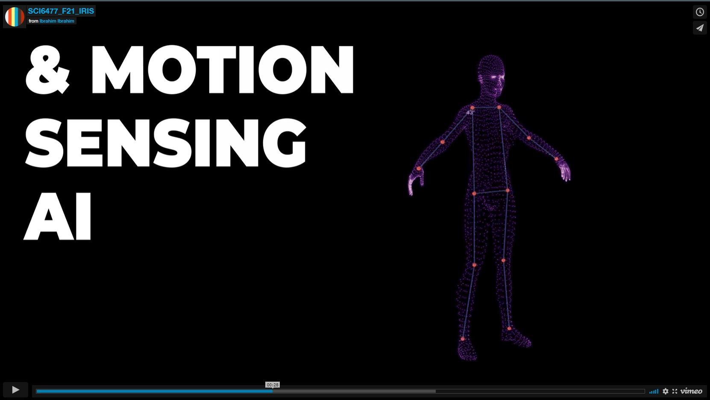

# Assistive Soft Robotics for Virtual Learning

Project done at **Harvard University**'s couse: SCI6477 Nano Micro Macro: Material Research Labratory  
**Instructors** Joanna Aizenberg & Jonathan Grinham  
**Team Members** Mariam AlJomairi, Ying Li, Ibrahim Ibrahim, Hye Jun  

_ _Click below to play the project video_ _

