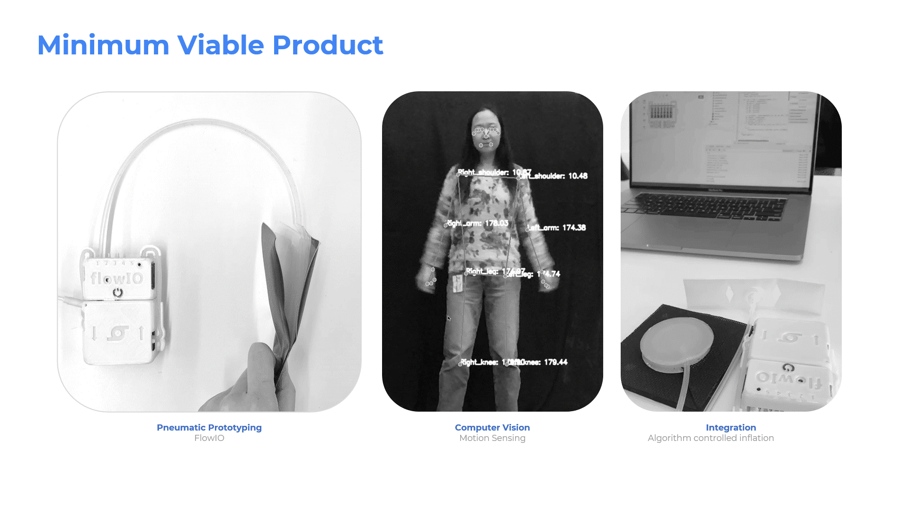

# Assistive Soft Robotics for Virtual Learning

Project done at **Harvard University**'s couse: SCI6477 Nano Micro Macro: Material Research Labratory  
**Instructors** Joanna Aizenberg & Jonathan Grinham  
**Team Members** Mariam AlJomairi, Ying Li, Ibrahim Ibrahim, Hye Jun  
  
_Click below to play the project video_  

  

  
For more information on the project, visit: [https://ibrahimibrahim.works/iris.html](https://ibrahimibrahim.works/iris.html).  

